# Sistema de Gestão de Biblioteca

Bancos de Dados

## Sobre o Projeto

Este projeto consiste no desenvolvimento completo de um sistema de gestão de biblioteca, desde a modelagem conceitual até a implementação de um banco de dados relacional funcional. O sistema foi projetado para gerenciar de forma eficiente livros, usuários, empréstimos e todo o ciclo de vida das operações de uma biblioteca.

---

## Estrutura do Projeto

```


CaseBiblioteca-Leega/          
   ├── Modelos/
   |   ├─ Dicionario_dados.xlsx
   |   ├─ modelagem_atualizada.pdf
   |
   |
   ├── Códigos/                      
       ├── banco.sql
       ├── trigger.sql
       ├── views_e_users.sql  
       ├── inserts_dados_biblioteca.sql
       ├── trigger.sql
       ├── Solicitações/
           ├── Imagens/
           ├── Queries 1, 2, 3..

── Readme.md                   

```

## Documentação e Modelagem

A documentação técnica completa do projeto foi centralizada na pasta `Modelos/`. Nela você encontrará:

*   **Modelagem Atualizada:** Modelo lógico atualizado, representando todas as tabelas, relacionamentos e cardinalidades do banco de dados.
*   **Dicionário de Dados:** Descrição detalhada de todas as tabelas, colunas, tipos de dados e restrições (constraints).

Esses documentos servem como referência principal para o desenvolvimento e manutenção do banco de dados `db_biblioteca`.

---


## Modelagem do Banco de Dados

### Estrutura do Banco de Dados

O banco de dados `db_biblioteca` foi implementado com **11 tabelas** relacionais:

#### Tabelas Principais

1. **autor** - Cadastro de autores das obras
   - ID_autor (PK)
   - nome_autor
   - nacionalidade

2. **editora** - Cadastro de editoras
   - ID_editora (PK)
   - nome_editora
   - logradouro
   - bairro
   - cidade
   - CEP

3. **obra** - Catálogo de livros
   - ID_obra (PK)
   - ID_editora (FK)
   - ID_autor (FK)
   - titulo_obra
   - numero_publicacao
   - genero
   - data_publicacao

4. **usuario** - Cadastro de usuários da biblioteca
   - ID_usuario (PK)
   - nome_usuario
   - logradouro
   - bairro
   - cidade
   - CEP
   - telefone
   - CPF (UNIQUE)

5. **cargo** - Cargos dos funcionários
   - ID_cargo (PK)
   - nome_cargo
   - salario

6. **departamento** - Departamentos da biblioteca
   - ID_departamento (PK)
   - nome_departamento

7. **funcionario** - Cadastro de funcionários
   - ID_funcionario (PK)
   - ID_cargo (FK)
   - ID_departamento (FK)
   - nome_funcionario
   - data_admissao
   - data_demissao

8. **estoque** - Controle de quantidade de livros
   - ID_estoque (PK composta)
   - ID_obra (PK composta, FK)
   - quantidade_livro

9. **reserva** - Registro de reservas de livros
   - ID_reserva (PK)
   - ID_funcionario (FK)
   - ID_estoque (FK)
   - ID_usuario (FK)
   - ID_obra (FK)
   - status_livro
   - data_reserva
   - hora_reserva

10. **emprestimo** - Registro de empréstimos
    - ID_emprestimo (PK)
    - ID_funcionario (FK)
    - ID_estoque (FK)
    - ID_usuario (FK)
    - ID_obra (FK)
    - ID_obra_antigo (correção de dados históricos)
    - ID_reserva (FK, NULL)
    - data_emprestimo
    - data_entrega
    - hora_emprestimo

11. **devolucao** - Registro de devoluções
    - ID_devolucao (PK)
    - ID_funcionario (FK)
    - ID_emprestimo (FK)
    - data_devolucao
    - hora_devolucao
    - multa_atraso

### Modelo Visual 


---

## Normalização

O banco de dados foi normalizado até a **3ª Forma Normal (3FN)** para garantir integridade e eliminar redundâncias.


## Scripts SQL e Solicitações

Esta pasta contém os scripts SQL utilizados no desenvolvimento do banco.

### Scripts principais

* **banco.sql**: criação do banco `db_biblioteca`, tabelas, chaves primárias/estrangeiras e principais constraints.
* **inserts_dados_biblioteca.sql**: carga inicial dos dados (dados-base do case) para validação das consultas e do funcionamento do sistema.

### Scripts complementares

* **functions.sql**: funções para apoiar regras de negócio (ex.: cálculo e verificação de atraso).
* **trigger.sql**: automações ligadas ao ciclo de empréstimo/devolução (ex.: baixa e reposição de estoque e bloqueio de empréstimo para usuário com atraso).
* **views_e_users.sql**: views e configuração de usuários/roles/grants.

> Observação: após a finalização do case, incluímos a configuração de usuários e permissões para que as regras de acesso já estejam disponíveis no banco quando necessário.


Abaixo está a lista completa de todas as 58 solicitações resolvidas neste projeto.


# Resolução dos Exercícios de Banco de Dados

---

### Lista de Exercícios e Resultados

**[1.](Códigos/Solicitações/1.sql)** A Diretora Camilla Prado solicitou uma pesquisa que informe todas as obras cadastradas no acervo ordenadas por data de publicação.

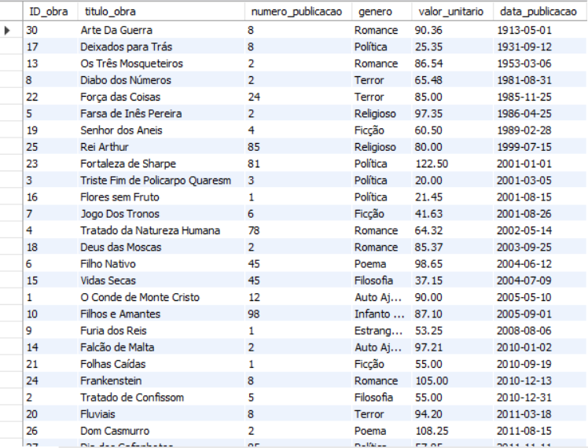

**[2.](Códigos/Solicitações/2.sql)** O Governador vai doar duzentos livros para a Biblioteca, mas só irá doar se a biblioteca tiver menos de 300 obras. O Gerente Márcio Tales solicitou que fosse feita a contagem de quantas obras a Biblioteca possui atualmente.

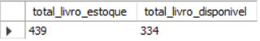

**[3.](Códigos/Solicitações/3.sql)** A Gerência solicitou uma pesquisa para saber quais datas ocorreram empréstimos de livros e a quantidade emprestada. A consulta deverá retornar apenas um registro para cada data.

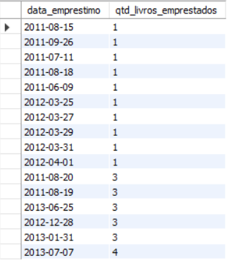

**[4.](Códigos/Solicitações/4.sql)** O Funcionário João Paulo Assistente de RH solicitou uma pesquisa que informasse todos os empréstimos que a Recepcionista Alice Meire fez no horário das 8hs as 9hs.

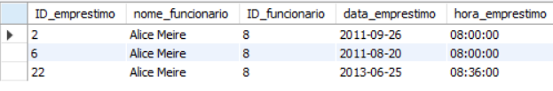

**[5.](Códigos/Solicitações/5.sql)** A Diretoria solicitou uma pesquisa sobre devolução de livros entre as datas 29/03/2012 a 02/02/2013.

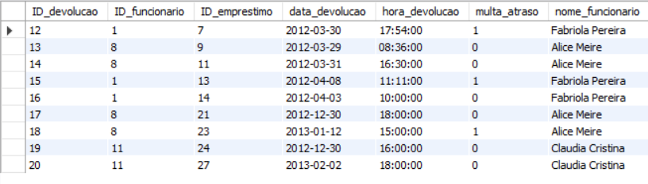

**[6.](Códigos/Solicitações/6.sql)** A Gerência solicitou uma pesquisa para saber quais reservas de livros que foram feitas com data maior ou igual a 18/08/2011 que ainda possuem o status de "reservado".

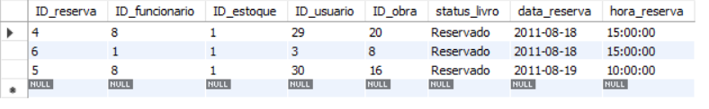

**[7.](Códigos/Solicitações/7.sql)** A área de RH solicitou uma pesquisa para saber quais devoluções de livros foram feitas antes de 29/03/2012.

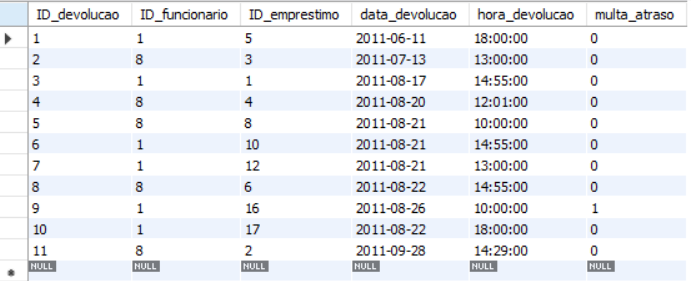

**[8.](Códigos/Solicitações/8.sql)** A Gerência solicitou uma pesquisa para saber quais obras existem no acervo que são diferentes dos títulos das obras 'O Conde de Monte Cristo' e 'Filhos e Amantes'.

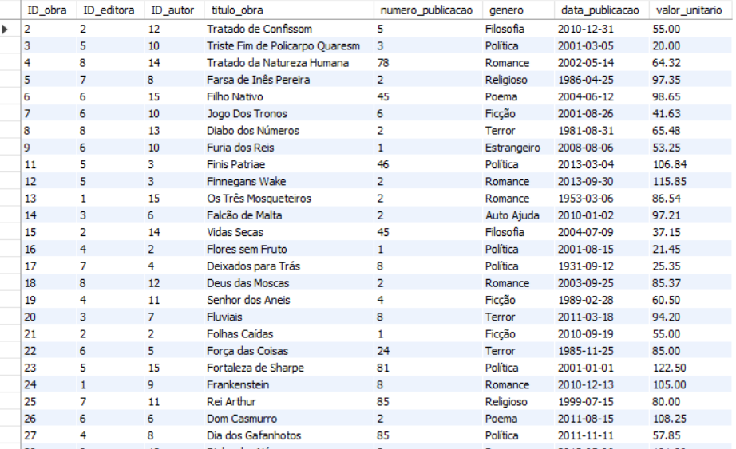

**[9.](Códigos/Solicitações/9.sql)** O Funcionário João Paulo solicitou uma pesquisa para saber quantas obras do gênero Ficção existem no acervo.

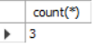

**[10.](Códigos/Solicitações/10.sql)** A Diretoria solicitou uma pesquisa para identificar qual o livro possuiu a maior quantidade em estoque, incluir respectiva editora e o respectivo autor.

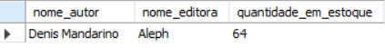

**[11.](Códigos/Solicitações/11.sql)** O Financeiro precisa saber qual é o livro que possui a menor quantidade em estoque e quantas vezes ele foi emprestado para que seja feita uma analise para compra de mais alguns exemplares.

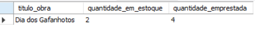

**[12.](Códigos/Solicitações/12.sql)** A área de RH precisa identificar a quantidade total dos empréstimos feitos por cada funcionário ativos.

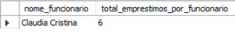

**[13.](Códigos/Solicitações/13.sql)** A Diretoria identificar as obras com os maiores números de publicações agrupados por genero.

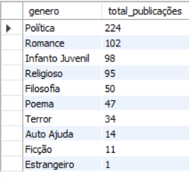

**[14.](Códigos/Solicitações/14.sql)** A Funcionária Alice Meire solicitou a alteração da obra 'Discurso do Método' para o gênero Político.


**[15.](Códigos/Solicitações/15.sql)** A Recepcionista Alice Meire solicitou a alteração do bairro do usuário 'Alberto Roberto' que morava no 'IAPI' e agora mora no bairro de 'Perdizes'.


**[16.](Códigos/Solicitações/16.sql)** A Biblioteca recebeu a visita de um grupo de alunos, mas após a visita foi verificado desaparecimento de três livros, as obras que sumiram do acervo foram 'Filho Nativo', 'Vidas Secas' e 'Dom Casmurro', com isto será necessária a alteração da quantidade de livros no estoque de cada obra.


**[17.](Códigos/Solicitações/17.sql)** A Recepcionista Claudia Cristina não conseguiu terminar o cadastro de cinco usuários que passaram pela Biblioteca, foi solicitado a inserção desses usuários.


**[18.](Códigos/Solicitações/18.sql)** Gerência solicitou uma consulta para verificar se existe duplicidade de usuários no Banco de Dados.

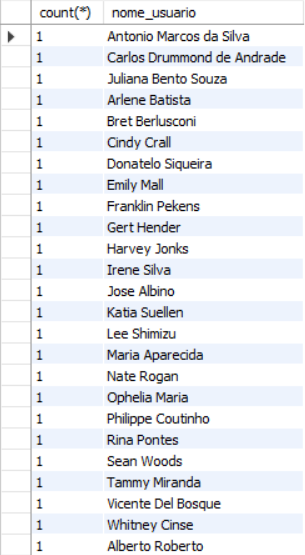

**[19.](Códigos/Solicitações/19.sql)** A Recepção recebeu a informação que existem dois usuários duplicados na base, será necessária a exclusão de um desses registros.


**[20.](Códigos/Solicitações/20.sql)** O Financeiro solicitou a inserção do valor individual de cada obra. Crie um campo com o nome Valor_Livro na tabela Obra. Defina o tipo de dados que poderá ser aceito e o valor de cada título.


**[21.](Códigos/Solicitações/21.sql)** A Consultoria verificou que o campo Multa_Atraso está com o tamanho Varchar(2), foi solicitada a alteração do campo para Varchar(3).


**[22.](Códigos/Solicitações/22.sql)** Foi verificado que o campo Multa_Atraso está com os registros preenchidos de forma errada, foi solicitada a alteração dos registros que forem 0 para Não e 1 para SIM.


**[23.](Códigos/Solicitações/23.sql)** A Diretoria solicitou a exclusão do campo Valor_Livro da tabela Obra pois, o pedido feito pelo Financeiro estava errado.


**[24.](Códigos/Solicitações/24.sql)** A Diretoria solicitou a lista de todos os livros que já foram emprestados mas foram entregues com atraso e os respectivos nomes dos funcionários que fizeram os empréstimos.

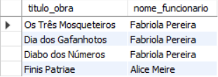

**[25.](Códigos/Solicitações/25.sql)** A Gerência solicitou a lista de todos os livros, cujos autores não são brasileiros, que já foram devolvidos e o valor total de cada livro.

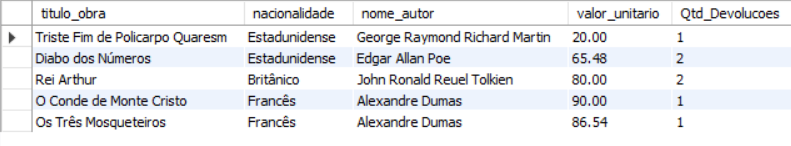

**[26.](Códigos/Solicitações/26.sql)** A área de RH solicitou a lista de todos usuários que fizeram empréstimo com o dia de entrega igual 21/08/2011.

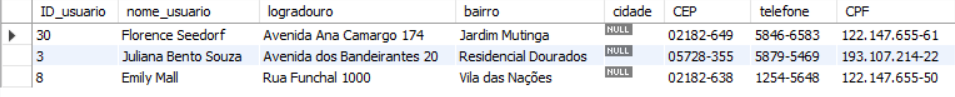

**[27.](Códigos/Solicitações/27.sql)** O Financeiro solicitou a lista de todas as obras que tiveram data de publicação menor que 04-03-2013, sua respectiva quantidade e o seu valor unitário.

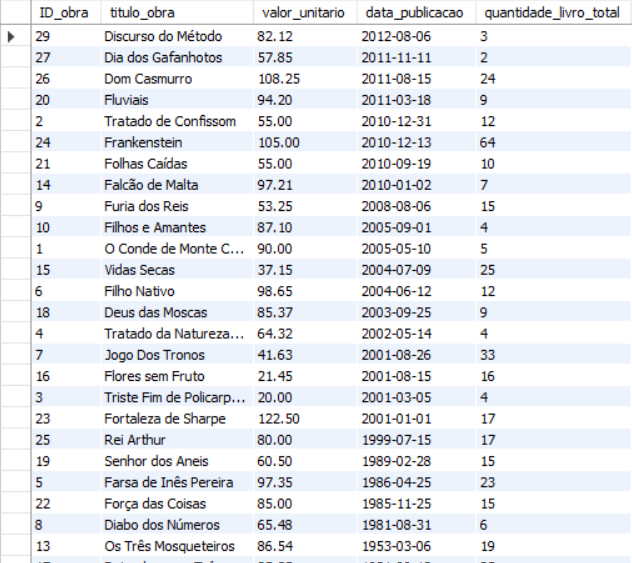

**[28.](Códigos/Solicitações/28.sql)** A área de RH solicitou a lista de todos os funcionários separados por ativos ou não, seus respectivos cargos e salários.

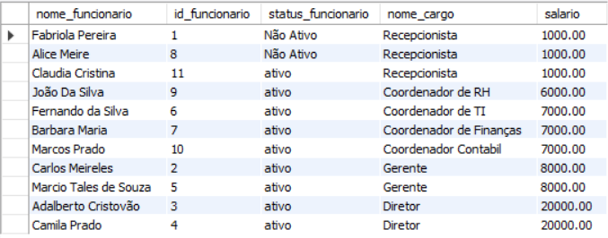

**[29.](Códigos/Solicitações/29.sql)** A Gerência solicitou uma lista de todos os livros com os nomes dos autores, nomes das editoras e a quantidade de livros em estoque.

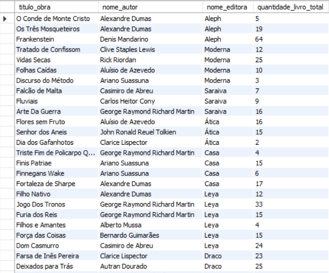

**[30.](Códigos/Solicitações/30.sql)** A Diretoria solicitou a lista de todos os funcionários da Biblioteca com seus respectivos departamentos que tem idade entre 30 e 40 anos.

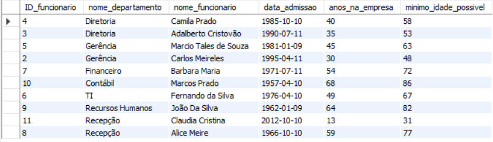

**[31.](Códigos/Solicitações/31.sql)** O Financeiro solicitou a criação de uma visão que retorne o nome do livro, seu autor e o valor.

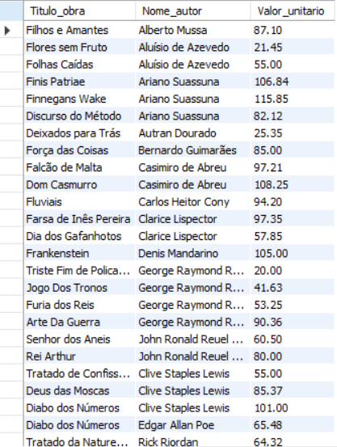

**[32.](Códigos/Solicitações/32.sql)** A Recepção solicitou uma lista com o código do livro, nome do livro cujo valor do livro seja maior que R$90,00.

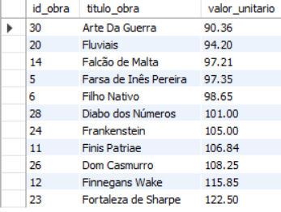

**[33.](Códigos/Solicitações/33.sql)** A área de RH solicitou a atualização do salário do Auxiliar Financeiro de 12% sobre o seu salário atual.


**[34.](Códigos/Solicitações/34.sql)** O Financeiro solicitou uma atualização da data de demissão da funcionária Alice Meire para o último dia do Mês que você se encontra atualmente.


**[35.](Códigos/Solicitações/35.sql)** A Gerência solicitou uma lista de todas as Obras, que contenham a letra "C" ordenadas por gênero e que tenham data de publicação entre 2011 e 2013.

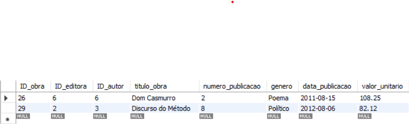

**[36.](Códigos/Solicitações/36.sql)** A Recepção solicitou uma lista como todos os funcionários da Biblioteca com código, nome, e departamento, classificado pelo nome do funcionário e que não emprestaram nenhum livro.

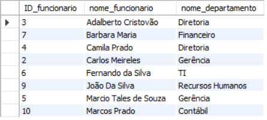

**[37.](Códigos/Solicitações/37.sql)** A Biblioteca solicitou uma lista que exiba a quantidade de logradouros de usuários agrupados por número do CEP.

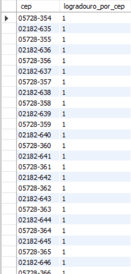

**[38.](Códigos/Solicitações/38.sql)** A Diretoria solicitou uma lista que exiba a quantidade de endereços agrupados por usuário.

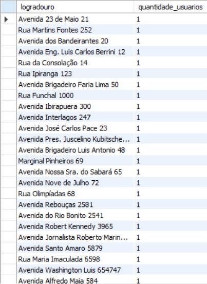

**[39.](Códigos/Solicitações/39.sql)** Foi solicitado a busca de informações de todas as obras que foram reservadas no dia 18/08/11 as 15:00 e o nome do responsável pela reserva.

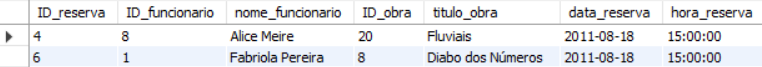

**[40.](Códigos/Solicitações/40.sql)** O financeiro solicitou o levantamento da informação de quando as usuárias Emily Mall e Whitney Cinse pegaram livros emprestados, quais foram os livros e seus respectivos valores unitários.

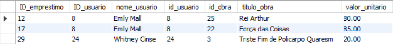

**[41.](Códigos/Solicitações/41.sql)** Hoje é aniversario da biblioteca e para comemorar foram comprados presentes a todos os usuários que foram os primeiros a utilizar a biblioteca, o gerente Carlos mendes pediu a relação da primeira pessoa a reservar, pegar emprestado e devolver um livro e suas respectivas informações para que possa ser entrado em contato com ele.

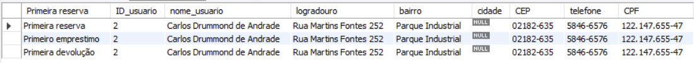

**[42.](Códigos/Solicitações/42.sql)** Foi solicitado pela diretoria saber quantas obras cada editora tem na biblioteca.

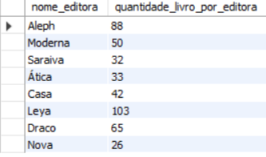

**[43.](Códigos/Solicitações/43.sql)** É fechamento referente ao mês de janeiro e a biblioteca está no vermelho, foi solicitado pelo financeiro que fosse feito um levantamento de todos os livros que não foram devolvidos, mostrando quantos dias de atraso e para cada dia foi dado uma multa de 5 reais, e mostrar o nome do usuário , livro emprestado e o total a receber pela biblioteca.

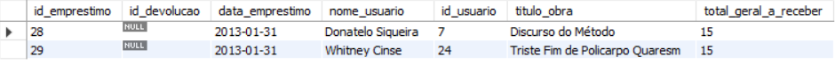

**[44.](Códigos/Solicitações/44.sql)** Foi solicitado a informação de todos os usuários que morem em uma avenida, e ainda, que seja mostrado o nome do usuário, CPF e logradouro em ordem de CPF do maior para o menor.

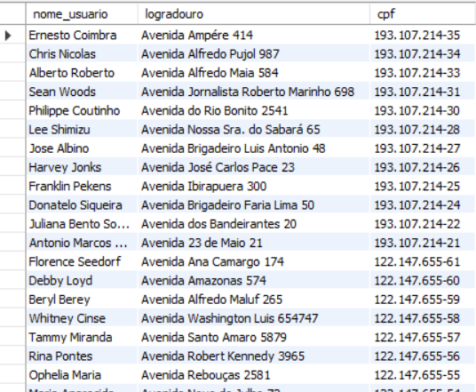

**[45.](Códigos/Solicitações/45.sql)** Chegou na biblioteca uma mensagem urgente da Camila pedindo um relatório contendo a informação de todos os livros que foram emprestados mais de uma vez nos anos de 2011 a 2013 agrupados pelo nome do livro.

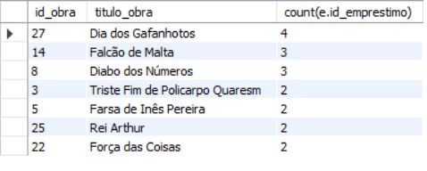

**[46.](Códigos/Solicitações/46.sql)** O Financeiro pediu para apresentar o valor médio dos livros e informar quais são os que estão abaixo dessa media, referente a devolução e empréstimo.

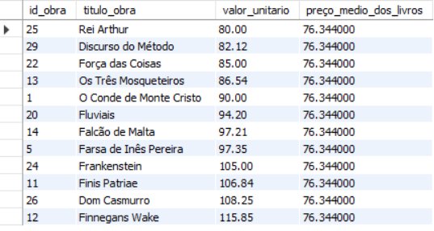

**[47.](Códigos/Solicitações/47.sql)** Barbara do financeiro pediu para verificar qual a media do salario dos funcionários e quem são os que ganham mais do que a media em cada departamento.

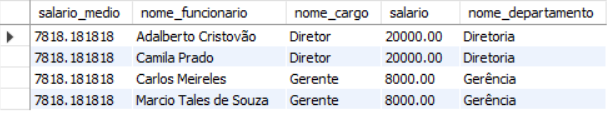

**[48.](Códigos/Solicitações/48.sql)** Carlos pediu que seja feita uma pesquisa informando de todos os usuários que tem cadastro na biblioteca e que nunca levaram livros mostrar o nome de todos em Maiúsculas.


**[49.](Códigos/Solicitações/49.sql)** A recepção pediu para verificar quais os usuários que já pegaram mais de 3 livros, e em caso positivo, mostrar nomes e quais livros, ordenando pelo CEP (crescente).

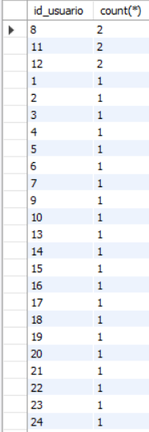

**[50.](Códigos/Solicitações/50.sql)** A diretoria pediu que fosse feito uma analise do estoque, apresentando uma lista com todos os livros que já foram reservados e emprestados e, mostrar quantos estão disponíveis classificados por Gênero.

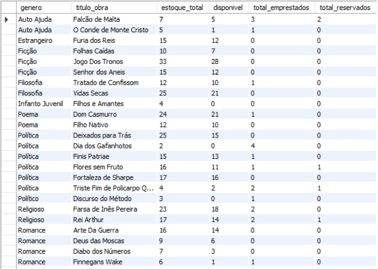

**[51.](Códigos/Solicitações/51.sql)** Foi solicitada a pesquisa de qual a hora que a biblioteca tem mais movimento e, também, qual o horário de menor movimentação, faça a avaliação de todas as horas de devolução, empréstimo e reserva.

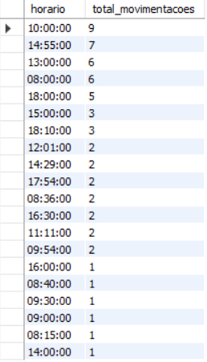

**[52.](Códigos/Solicitações/52.sql)** A sociedade brasileira de editoras solicitou o levantamento para a biblioteca de qual são os 3 autores que tem mais livros lidos no ano de 2012 e 2013 e os 2 que tem menos obras lidas.

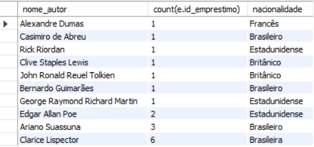

**[53.](Códigos/Solicitações/53.sql)** Crie uma tabela que exiba uma lista de todos livros por funcionario, o total de empréstimos e devoluções que cada um atendeu.

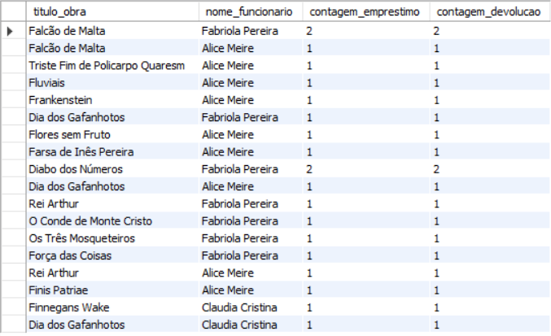

**[54.](Códigos/Solicitações/54.sql)** A biblioteca quer fechar parceria com as editoras, e existem usuários que trabalham nas editoras facilitando esse contato, para tanto, verificar quais usuários possuem o mesmo endereço das editoras.

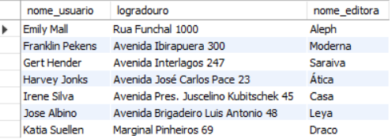

**[55.](Códigos/Solicitações/55.sql)** Foi solicitado a criação de uma visão que traga todos os livros e o preço da editora Leya.

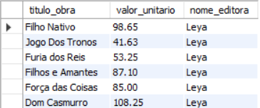

**[56.](Códigos/Solicitações/56.sql)** A biblioteca foi comprar mais livros para aumentar seu acervo, mas a editora Saraiva aumentou em 16% ovalor de seus livros, atualize os preços dos livros da editora na porcentagem designada.


**[57.](Códigos/Solicitações/57.sql)** Foi solicitado apresentarmos quais as 5 obras que tiveram menos publicações e as 5 de maior, ainda, mostrar qual o autor, editora, nome do livro e quantidade de publicações em ordem decrescente.

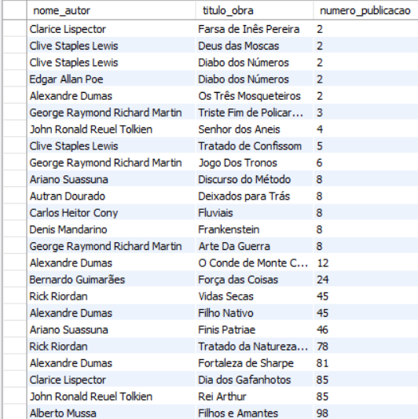

**[58.](Códigos/Solicitações/58.sql)** Fazem cento e noventa e três meses que o instituto bibliográfico brasileiro surgiu. Para comemorar a diretoria pediu a relação de todos os usuários que tem o cpf com o começo 193 que receberão um presente de comemoração. Foi solicitado informar o nome e o cpf mascarando os dígitos do meio com asteriscos.

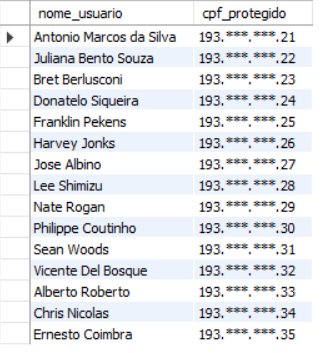
